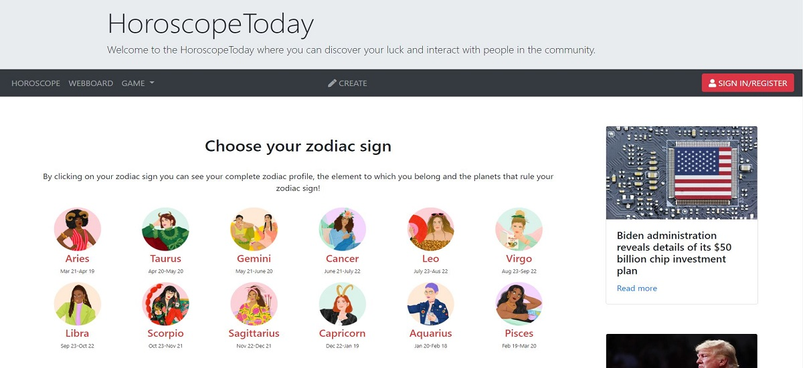

<!-- PROJECT HEADER -->

<h1 align="center">:small_orange_diamond: HoroscopeToday :small_orange_diamond:</h1>

  

<!-- ABOUT THE PROJECT -->
## :memo: About The Project

A Horoscope website that retrieves a daily horoscope from API and google news API version2 using PHP operation on the backend. I've include a fun feature of 
the website by adding a mini game for users to play along while visiting my app. 
   &emsp;- Fortune cookie game that retrieves a random quote from the API generator website.  
   &emsp;- Aske the Genie game that generate a random answer upon your question using JavaScript.  

  This website is hosted on <a href="https://www.heroku.com">Heruko</a>

  <h3>Project resource</h3>
  <ul>
    <label>API</label>
    <li>https://aztro.sameerkumar.website</li>
    <li>https://newsapi.org/s/google-news-api</li>
    <li>https://api.adviceslip.com/advice</li>
    <label>Images</label>
    <li>https://astrostyle.com/horoscopes/daily</li>
    <li>https://www.astrozodiacs.com</li>
    <li>https://www.horoscope.com</li>
  </ul>

<a href="https://horoscopetoday.herokuapp.com">View Demo</a>

(<a href="#readme-top">back to top</a>)

<!-- Technologies use -->
## :wrench: Built With

* [![JavaScript.com]][JavaScript-url]
* [![Bootstrap][Bootstrap.com]][Bootstrap-url]
* [![Php.net]][Php-url]

(<a href="#readme-top">back to top</a>)

<!-- Future -->
## :rocket: Future development
* Create a social media login
* Create a personal blog according to log-in member

(<a href="#readme-top">back to top</a>)

<!-- CONTACT -->
## :love_letter: Contact me

Email: - jpratheeppornsak@gmail.com

Project Link: [https://horoscopetoday.herokuapp.com/](https://horoscopetoday.herokuapp.com/)

(<a href="#readme-top">back to top</a>)

<!-- MARKDOWN LINKS & IMAGES -->
<!-- https://www.markdownguide.org/basic-syntax/#reference-style-links -->
[linkedin-shield]: https://img.shields.io/badge/-LinkedIn-black.svg?style=for-the-badge&logo=linkedin&colorB=555
[linkedin-url]: https://linkedin.com/in/linkedin_username
[product-screenshot]: images/screenshot.png
[Bootstrap.com]: https://img.shields.io/badge/Bootstrap-563D7C?style=for-the-badge&logo=bootstrap&logoColor=white
[Bootstrap-url]: https://getbootstrap.com
[Php.net]: https://img.shields.io/badge/php-B0B3D6?style=for-the-badge&logo=php&logoColor=black
[Php-url]: https://www.php.net
[JavaScript.com]: https://img.shields.io/badge/JavaScript-F0DB4F?style=for-the-badge&logo=JavaScript&logoColor=black
[JavaScript-url]: https://www.javascript.com/
